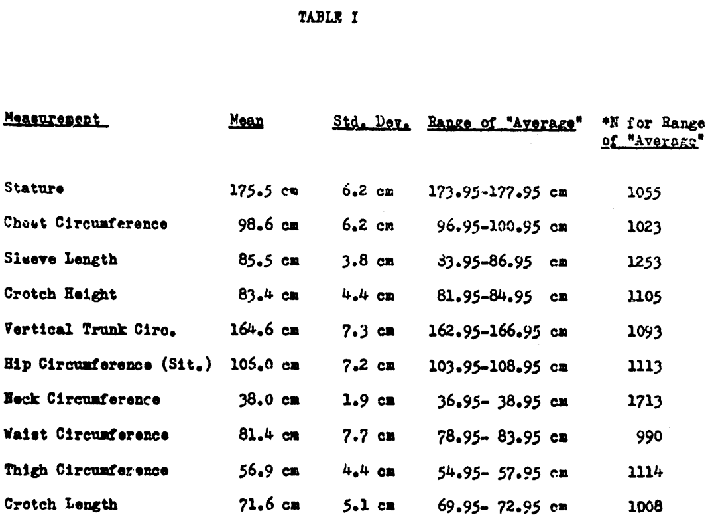
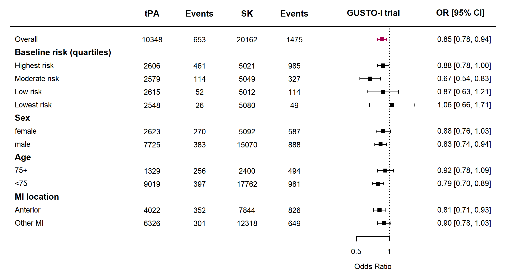
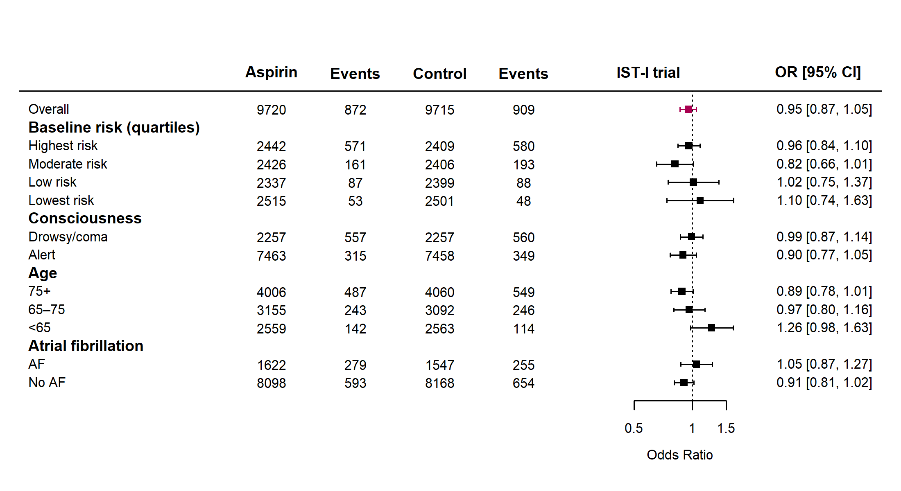
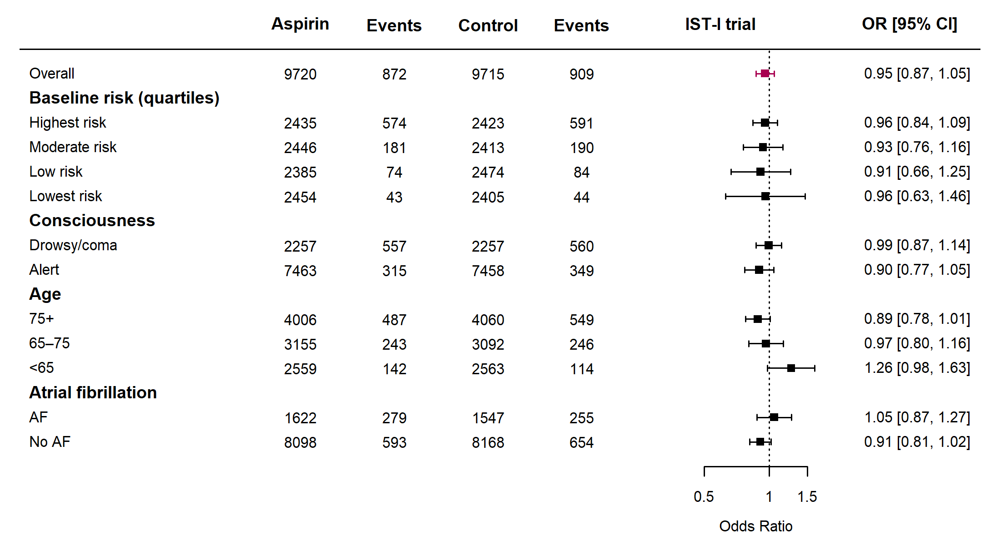
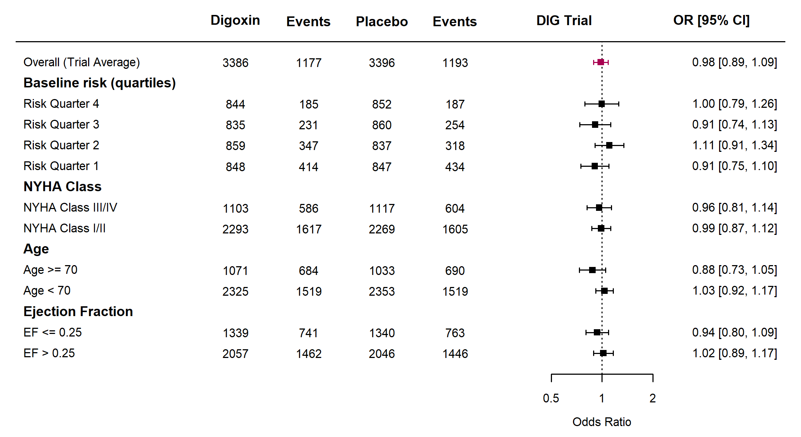
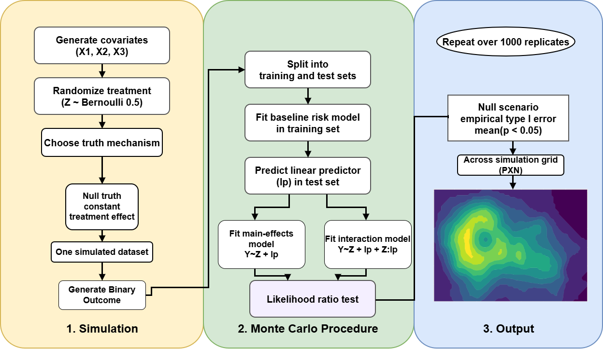

# Introduction

In mid-20th century, the US Air Force faced a life threatening challenge. Blame fell on the men in the cockpits, which lead to citing "pilot error" in crash reports as the main etiology. After a thorough investigation, it was found that the problem was not with the pilots but with the design of the cockpit itself. Earlier in the twentieth century, engineers attempted, for the first time to design a fighter plane cockpit that would fit the average pilot. By measuring hundreds of male pilots, researchers established standards for cockpit design, including seat and helmet size, the distance from a pilot’s feet to the throttle, and the reach from the hands to the control stick. These standards were used for more than two decades. However, when 4,063 pilots were measured, it was found that not a single pilot matched the “average” dimensions across all the parameters used to design the fighter-plane cockpit. In other words, nobody actually fit the average-based cockpit design [@rose_end_2016].

"The tendency to think in terms of the 'average man' is a pitfall into which many persons blunder when they attempt to apply human body size data to design problems." [@zotero-item-39]

```{r measures, echo=FALSE, message=FALSE, warning=FALSE, fig.align='center', fig.pos='!htbp', out.width='80%', fig.cap='Measures of original cohort of 4063 men for "Approximate Average". The original measurements were intended to provide a combined generalisation of the overall population. Daniels, 1952'}

```

This historical encounter reflects similar challenge in the modern evidence-based medicine[@kent_personalized_2018]. In medical research, randomized controlled trial (RCT) is used to decide if a treatment is effective or not for a particular medical intervention. National and International guidelines for clinical decision making developed based on this gold standard [@kent_predictive_2020]. However, the average treatment effect resulted that comes from RCT findings fail to answer the practicing clinician question regarding the most likely outcome of an intervention for a particular patient that appears to a clinical service setting. The primary reason for this is that real patient in clinical setting usually differs from the average patient in a trial [@willke_concepts_2012; @kent_personalized_2018].

Modern trials increasingly enroll patients with less severe disease who are less likely to derive significant benefit from an intervention. Due to this, low-risk patients may attain minimal benefit, swaying the average effect size and reducing the statistical power of the trial, yielding negative or null results. As a result, higher-risk patients who actually possess the potential for a greater-than-observed benefit are left untreated and denied therapy. Conversely, trials tend not to enroll complex older patients with multiple co-morbidities. Unfortunately, the findings from trials are generalized to them in clinical practice. This, in turn, results in overtreatment, as these patients may suffer unique treatment-related harms [@greenfield_heterogeneity_2007].

Trial results represent summary data from a selected pool of patients, whereas variation in treatment response is captured by the concept of Heterogeneity of Treatment Effect (HTE), which has heightened relevance in recent research agendas of precision medicine and comparative effectiveness research [@kent_predictive_2020]. A truly individual treatment effect is generally not identifiable from observed trial data, so most HTE analyses instead target conditional average treatment effects within groups of patients sharing similar characteristics. HTE refers to the non-random variation in the magnitude or direction of a treatment effect across levels of a patient attribute, or covariate, for a specific clinical outcome [@varadhan_estimation_2013]. Though the ultimate aim of traditional evidence-based medicine is to establish causality at a population level, the emergence of precision medicine and patient-centered research has elicited interest in identifying these individual variations [@selby_predictive_2025]. HTE is classified as quantitative when the treatment is beneficial for everyone but to different degrees, or qualitative when a treatment is beneficial for some but harmful for others [@wang_statistics_2007].

In spite of these developed predictive frameworks, most clinical trial reports continue to rely on conventional subgroup analysis [@kent_predictive_2020]. This is done by dividing the trial population one variable at a time, using characteristics such as age or sex, to try and evaluate any treatment effect variation, for instance between males and females or young versus old patients. Nevertheless, this traditional approach fails as it cannot inform a clinician how to treat a patient who is simultaneously elderly, female, and has a low ejection fraction and a family history of myocardial infarction. A patient's response to therapy is determined by a case mix of clinically prognostic risk factors acting jointly, rather than isolated attributes [@bellavia_heterogeneity_2024; @califf_selection_1997]. Subgroup analysis fails to capture these multivariate treatment response patterns by underrepresenting the heterogeneity that clinicians observe at the person level [@kent_personalized_2018]. For a patient brings not only their sex or age when approaching a clinical setting. 

One of the reasons for the low credibility of conventional subgroup analyses is the problem of multiplicity. Unlike the primary trial analysis, which is protected by pre-specified protocols and power calculations, subgroup analyses are frequently performed licentiously across a number of baseline variables. This creates a high risk of false positive (type I error) results, a risk that increases significantly with every additional comparison conducted [@wang_statistics_2007]. By examining many variables without a clear prior hypothesis, we inevitably begin to see patterns where there are none, essentially mistaking the noise of a specific dataset for a genuine biological signal [@kent_personalized_2018; @senn_heterogeneous_2026]. For instance, if the null hypothesis is true for 10 independent tests for interaction at the 0.05 significance level, the chance of at least one false positive result exceeds 40% [@wang_statistics_2007]. Such exploratory analyses usually end up in testimation bias, which is also known as the winner's curse. The reason for this bias is that researchers preferentially report exclusively those subgroups that reach a specific threshold of statistical significance, namely a p-value less than 0.05. Owing to this, observed effect sizes become inherently inflated, reflecting the most extreme and overestimated deviation from the truth [@kent_personalized_2018].

The other reason for unreliability in subgroup analysis is a significant mismatch in statistical power. RCTs are designed and powered to detect a main treatment effect in a large population, and they are hardly designed to detect interactions between subgroups. [@willke_concepts_2012] In fact, such detection may require a fourfold sample size compared with the main treatment effect analysis. For instance, in a trial where power is 80% for the average effect, a test for a perfectly balanced subgroup (e.g., young versus old) is anticipated to have a power of only about 30%.[@kent_personalized_2018]

This power mismatch mostly yields false negative (Type II error) results, where treatment looks like it has a consistent effect across all subgroups in a forest plot, but practically the study lacked the statistical strength to detect genuine variations [@bellavia_heterogeneity_2024]. A good example can be seen in the GUSTO-I trial. Even in a study of this great scale, there is limited statistical power to detect a quantitative interaction between a specific risk factor and the relative benefit of accelerated tissue plasminogen activator (tpa), primarily due to low event rates. For instance, a formal test conducted to determine if the relative benefit of treatment relies on age yielded a tpa-by-age interaction that had a p-value of 0.23 [@califf_selection_1997]. In this study, the estimates of the two age slopes were 0.008 and 0.0086. Mathematically, the difference between the slopes would have needed to be 0.014 instead of 0.0006 to provide 80% power to detect a significant differential effect of tpa according to age. This can serve as evidence that, for the purpose of external validity, no trial would likely enroll sufficient elderly patients to conduct such a test with a high degree of confidence, leaving hidden potential heterogeneity behind the trial average [@califf_selection_1997].

A common methodological error in conventional reporting is claiming heterogeneity based on separate tests of significance within subgroups, for example, that a drug worked for women with a p-value of 0.02 but not for men with a p-value of 0.14 [@wang_statistics_2007]. Statistically speaking, this is not proof of a treatment effect difference between the two sexes; it only shows that the specific study suffers from a lack of power to reach statistical significance in the smaller male group [@wang_statistics_2007]. Present guidance now requires that HTE be assessed using interaction terms in regression models, which test if the difference between groups is significant, rather than testing each group in isolation [@kent_assessing_2010]. Nevertheless, testing for interaction demands four times the sample size required for the main effect analysis, and the majority of trials remain blind to genuine variations in treatment response [@wang_statistics_2007; @varadhan_estimation_2013].

In contemporary medical research, pre-planned subgroup analysis remains a standard tool for exploring HTE. Notwithstanding, there is a growing methodological consensus that such an approach may not represent the most appropriate means of investigating individual treatment variation [@willke_concepts_2012]. This inadequacy is accentuated by a caution from the Consolidated Standards of Reporting Trials (CONSORT) statement [@gabler_dealing_2009]. In spite of this caution, univariate cuts remain dominant in clinical reporting, often leading to overinterpretation of chance findings [@kent_personalized_2018].

A critical conceptual error in conventional subgroup reporting is reliance on the relative scale (e.g., odds ratios or hazard ratios) to conclude the consistency of treatment effect [@sun_is_2010]. While relative effects often remain constant across subgroups, the absolute risk reduction (ARR) varies based on a patient's baseline risk. This mathematical relationship is known as risk magnification; as a patient's baseline risk increases, the absolute benefit he or she derives from an effective treatment also increases [@selby_predictive_2025]. Traditional subgroup analysis, focusing solely on relative scales, obscures larger differences in the number of lives saved, failing to identify that a drug might be life-saving for a high-risk group while offering negligible benefit to a low-risk group [@kent_personalized_2018].

Beyond the inability to demonstrate benefit, conventional subgroup analysis often omits net treatment harm [@kent_predictive_2020]. Almost all medical interventions do not come without a risk of some serious adverse effect, such as intracranial haemorrhage, major bleeding, or other respective complications, following their treatment benefit. For those who fall into the high-baseline-risk patient strata, the absolute disease-preventing benefit from a drug far outweighs these complications. On the other hand, for low-risk patients, the same adverse effects can totally wear down the marginal benefit [@kent_assessing_2010]. This leads to qualitative interactions where treatment causes more harm than benefit [@wang_statistics_2007; @gabler_dealing_2009]. Because patients fall into broad categories in the eyes of a one-variable-at-a-time approach, these groups usually appear treatment-favorable on average by hiding a significant portion of patients who are situated in a harm zone.

A major structural flaw in depending on trial averages and conventional subgroups is the skewed distribution of baseline risk, referred to as the Lake Wobegon Effect. In most clinical trials, often nearly 75% of participants lie below average risk. Then the trial average effect size is inevitably driven by the small influential quarter of high-risk outliers [@kent_personalized_2018]. Hence, applying the trial average to a real patient sitting in a clinical setting will undoubtedly be misleading and lead to systematic overtreatment of low-risk individuals [@greenfield_heterogeneity_2007].

In 2020, an expert panel funded by the Patient-Centered Outcomes Research Institute (PCORI) published the Predictive Approaches to Treatment Effect Heterogeneity (PATH) statement [@selby_predictive_2025]. The statement was delivered from the conceived argument that traditional RCTs fail to answer "what is the most likely outcome when this particular drug is given to a particular patient?", a question that one practicing physician may raise, as the epidemiologist Sir Austin Bradford Hill argued [@kent_personalized_2018]. As a remedy, the PATH framework provides guidance for conducting predictive HTE analyses by incorporating multiple clinically prognostic attributes simultaneously rather than serially dividing populations into secluded subgroups [@selby_predictive_2025].

A guiding doctrine of the PATH framework is that HTE is a scale-dependent concept; its presence or absence depends on whether the effect is measured on a relative scale or an absolute scale [@kent_predictive_2020]. The PATH statement emphasizes that HTE needs to be measured on both the relative scale (e.g., odds ratio) and the absolute scale (e.g., risk difference), noting that the latter is far more relevant in clinical settings for making treatment decisions and for individual patients. This shift in methodology is considered an indispensably formative leap towards realizing the full potential of personalized evidence-based medicine. The PATH framework gives two different approaches for predictive HTE analyses: risk modelling and effect modelling. The former disaggregates patients on the basis of baseline-risk strata, while the latter directly estimates individual effects using interaction terms or machine learning algorithms [@kent_predictive_2020]. 

Risk modelling is the first-line intervention that the framework recommends when RCTs yield an overall treatment effect [@kent_predictive_2020]. It is a two-step process. First, a multivariable model which is blinded to treatment assignment is used to predict each patient's baseline risk across the population for the primary outcome. Secondly, all patients will be stratified into equal-sized risk quartiles, to evaluate how treatment effect varies as a function of different risk levels on both relative and absolute measurement scales [@selby_predictive_2025; @kent_predictive_2020].

In contrast, effect modelling allows direct estimation of individualized treatment effects [@kent_personalized_2018]. This is computed using regression models that incorporate multiplicative interaction terms or modern, non-parametric machine learning algorithms such as random forests or causal forests [@selby_predictive_2025]. Since these models look for interactions, they are highly vulnerable to overfitting and testimation bias [@kent_predictive_2020]. A recently conducted scoping review of 65 reports that implemented the PATH statement highlighted crucial insight into the credibility of predictive methods. It states that risk-based modeling was significantly more likely, with an 87% credibility rate, to yield credible and reproducible findings than effect modeling. Owing to this, the PATH framework suggests that effect modelling findings be externally validated in independent datasets to establish their clinical credibility [@selby_predictive_2025].

The primary objective of this research is to implement and evaluate the PATH (Predictive Approaches to Treatment Effect Heterogeneity) framework across four large clinical trial datasets; the Digitalis Investigation Group Trial, the International Stroke Trial, the GUSTO-I trial, and the Vitamin D and Omega-3 Trial, to determine its utility in providing more patient-centered evidence than the traditional population average and the one-variable-at-a-time approach used in traditional subgroup analysis. This paper will implement predictive HTE analyses to compare patient-centered estimates of outcome risks under intervention versus under control, while accounting for clinically prognostic patient attributes simultaneously. This investigation will apply suitable statistical and machine learning methods to predict patient outcomes, including logistic regression, Cox proportional hazards models, and random forests, respectively. Considering the PATH statement guidelines, the paper aims to apply these predictive risk models to estimate the benefit of experimental treatments under different levels of baseline risk.

A secondary aim is to employ Monte Carlo simulations designed under the Aims, Data-generating mechanism, Estimand, Method, and Performance (ADEMP) structure to evaluate the Type I error behavior of risk-based interaction tests, ensuring that identified heterogeneity represents a reproducible clinical signal rather than statistical noise. Ultimately, this paper tries to show treatment benefit predictions and their associated uncertainty to bridge the gap between group-level trial results and the particular patient sitting in the clinical cockpit.

The remainder of this report is structured to evaluate the predictive approaches and their implications for clinical care. The method section describes the statistical model specification and computational implementation for each of the four trials. It will also bring into visibility the novel statistical method of the ADEMP simulation framework. The results section presents findings through PATH-compatible forest plots and absolute-benefit curves, empirically demonstrating the mathematical reality of risk magnification.

To conclude, we will synthesize these results to explore the policy and reporting implications for clinical guidelines, trying to address the structural barriers to transitioning from population averages toward a more patient-centered, evidence-based medicine.


# Trial Characteristics
```{r trial-characteristics, echo = FALSE, fig.align='center' }
library(gt)

trial_summary <- data.frame(
  Characteristic = c("Goal", "Patients (n)", "Years ran", "Design", "Follow-up"),
  IST = c(
    "Aspirin and heparin in acute ischaemic stroke",
    "19,435",
    "1991-1996",
    "Open-label RCT",
    "14 days and 6 months"
  ),
  DIG = c(
    "Digoxin for mortality and hospitalization in heart failure",
    "6,800",
    "1991-1995",
    "Double-blind placebo-controlled RCT",
    "37 months (Mean)"
  ),
  GUSTO = c(
    "Thrombolytic strategies in acute myocardial infarction",
    "41,021",
    "1990-1993",
    "Open-label RCT",
    "30 days"
  ),
  VITAL = c(
    "Vitamin D3 & Omega-3 for cancer/CVD prevention",
    "25,871",
    "2011-2017",
    "Placebo-Controlled RCT, Factorial (2 by 2)",
    "5.3 years (Median)"
  )
)

trial_summary %>%
  gt() %>%
  tab_caption(
    md("Summary characteristics of the four cardiovascular trials included in the PATH analyses.  Original Studies are linked in the header, with dataset accessibility below.")
  ) %>%
  cols_label(
    Characteristic = "Characteristic",
    IST = md("[International Stroke Trial](https://pubmed.ncbi.nlm.nih.gov/?term=9174558)"),
    DIG = md("[DIG Trial](https://pubmed.ncbi.nlm.nih.gov/9036306/)"),
    GUSTO = md("[GUSTO-I Trial](https://pubmed.ncbi.nlm.nih.gov/8204123/)"),
    VITAL = md("[VITAL](https://www.nejm.org/doi/pdf/10.1056/NEJMoa1809944)")
  ) %>%
  cols_width(
    Characteristic ~ px(120),
    everything() ~ px(140)
  ) %>%
  tab_options(
    table.width = px(700),
    table.font.size = px(10)
  )
```

As summarized in Table 1, the four trials included in this analysis are all cardiovascular in nature and are, by the standards of predictive heterogeneity research, relatively large studies. This is important in the PATH context, where adequate sample size is emphasized as a key requirement for reliable exploration of treatment-effect heterogeneity. Collectively, these trials also permit comparison across different endpoint structures, including fixed-time binary outcomes in GUSTO-I, IST-I, and DIG, and time-to-event outcomes in VITAL. Just as importantly, they vary in the strength of their reported overall treatment effects: GUSTO-I provides an example of a trial with a comparatively strong beneficial treatment effect, whereas DIG and VITAL provide examples where little or no clear overall benefit of intervention was observed. The PATH statement advises caution when interpreting treatment-effect heterogeneity in trials that demonstrate weak or absent overall treatment effects. The variation in overall treatment efficacy across these studies therefore provides an opportunity to formally assess how PATH performs under differing treatment-effect scenarios [@kent_predictive_2020]. Data accessibility was also an important consideration in dataset selection, as implementation of the PATH framework required trial datasets with sufficient available baseline and outcome information for analysis. This constraint influenced the final set of examples examined here and is considered further in the Limitations section.

A unique consideration must be taken for the DIG trial. As we are using a teaching dataset, in which, the variables have been permuted over the set of patients within treatment group. Therefore, this dataset is not appropriate to be used in a way that would allow for detection of HTE across treatment groups, but rather as a null case, in which we expect there to be exactly the opposite [@InternationalRandomizedTrial1993].

The datasets used in this analysis were obtained from publicly available or application-based repositories: 

- The GUSTO-I dataset was accessed from the Harrell Feasibility Repository at [http://hbiostat.org/data/repo/gusto.rda](http://hbiostat.org/data/repo/gusto.rda) (accessed October 2025). 
- The IST-I dataset was obtained from the supplementary materials associated with [https://pmc.ncbi.nlm.nih.gov/articles/PMC3104487/](https://pmc.ncbi.nlm.nih.gov/articles/PMC3104487/) (accessed January 2026). 
- The DIG trial teaching dataset was accessed through BioLINCC at [https://biolincc.nhlbi.nih.gov/studies/dig/](https://biolincc.nhlbi.nih.gov/studies/dig/) (accessed October 2025).
- The VITAL dataset was accessed through Project Data Sphere at [https://data.projectdatasphere.org/projectdatasphere/html/content/454](https://data.projectdatasphere.org/projectdatasphere/html/content/454) (accessed March 2026), for which access required application through the Project Data Sphere service.

# Methodology and Results

## Statistical Analyses

Multivariable logistic regression was used as the principal baseline-risk modelling approach in the GUSTO-I, IST-I, and DIG analyses because these trials involved binary clinical outcomes, for which logistic models provide a natural framework by relating prognostic covariates to the log-odds of an event. This is also the conventional regression-based approach outlined in the PATH statement for risk modelling in treatment-effect heterogeneity analyses [@kent_predictive_2020]. In general form, the model is written as Equation \ref{eq:logistic-general}, where \(\pi_i\) is the probability of the outcome for individual \(i\). In these datasets, predictive performance was strengthened through covariate adjustment, allowing multiple clinically relevant baseline characteristics to be incorporated simultaneously; such adjustment can improve efficiency and credibility in clinical trial analyses [@10.1093/biomet/asaf029], and, as discussed by Janssen et al., adjustment or updating can improve model calibration and predictive accuracy in applied clinical settings [@janssenSimpleMethodAdjust2009].

In this framework, the covariates used for baseline risk prediction need not be identical to those used in adjusted treatment-effect models. Risk models may incorporate a broader set of prognostic variables to improve prediction, whereas treatment-effect models are often adjusted using a more limited subset selected for clinical relevance, precision, and interpretability.

\begin{equation}
\log\left(\frac{\pi_i}{1-\pi_i}\right) = \beta_0 + \beta_1 x_{i1} + \cdots + \beta_m x_{im}
\label{eq:logistic-general}
\end{equation}

Random forest models were additionally implemented in the GUSTO-I and IST-I analyses as a sensitivity analysis to examine whether the observed patterning of treatment benefit across baseline-risk quartiles was robust to a non-parametric risk-modelling strategy. Random forests extend the single decision-tree framework by repeatedly partitioning the predictor space through recursive binary splitting and then aggregating predictions across a large ensemble of trees, thereby reducing instability and variance relative to an individual tree [@Matsuki02012016]. In this analysis, the models were fitted using the `ranger` package introduced by Wright and Ziegler, with 1,000 trees and probability estimation enabled, allowing individual-level event probabilities to be extracted directly from the fitted ensemble [@JSSv077i01]. As with the logistic-regression analyses, only covariates measured at baseline were included, and the resulting predicted probabilities were used to define risk quartiles for subsequent PATH-based comparisons of treatment effect.

Cox proportional hazards modelling was used for the VITAL trial because its primary endpoint was time to cardiovascular death, rather than a fixed binary event indicator. Unlike the logistic-regression analyses, this required a time-to-event approach capable of incorporating follow-up time and censoring. The Cox model provides a semi-parametric framework in which the baseline hazard remains unspecified while covariate effects are modelled multiplicatively on the hazard scale. In general form, the model is written as Equation \ref{eq:vital-cox}. Implementation of the Cox model requires consideration of the proportional hazards assumption, the assumption of an approximately linear effect of continuous covariates on the log-hazard scale, and the need for independent censoring and appropriately specified covariate structure [@dessaiTestingInterpretingAssumptions2019]. In the present analysis, baseline risk was estimated using covariates collected prior to treatment allocation, and the resulting predicted risks were then incorporated into the PATH framework in a manner analogous to the binary-outcome trials.

The PATH approach was implemented in the IST-I, GUSTO-I, DIG and VITAL trials as outlined in Figure \ref{fig:path-workflow}. Following data ingestion and exploratory analyses, risk modelling was performed using pre-specified, adjusted baseline models for each trial as described above. These risk models were blinded from treatment allocation and employed to assess the relationship between baseline risk distributions and treatment effect on an absolute scale, in line with recommendations from Kent and Colleagues [@kent_predictive_2020].

For illustration of the PATH framework, predicted baseline risk was further divided into quartiles to allow comparison of treatment effects across ordered risk strata in a form that remains visually interpretable. In trials showing some variation in the overall absolute treatment effect, the absolute-benefit plots therefore included not only the proportional-effect line but also a more flexible modelling approach based on spline functions, allowing departures from strict proportionality across the baseline-risk distribution to be visualized. The PATH-compatible forest plots additionally include conventional one-variable-at-a-time subgroups, commonly reported in RCTs, to show how a PATH-based presentation may be reported in a format familiar to audiences accustomed to traditional subgroup analyses. Heterogeneity statistics automatically produced by the `metafor` package [@JSSv036i03] were not displayed in these relative-effect plots, because those summaries are designed for meta-analytic settings in which estimates are treated as arising from different trials with an assumed distribution of treatment effects, rather than from risk strata and subgroups within a single trial.

The absolute-benefit plots were designed to show both the estimated treatment benefit across baseline risk and the observed distribution of patients along that risk scale. To aid interpretation, the baseline-risk distribution was overlaid along the x-axis as a semi-transparent density displayed in grey, allowing regions with greater patient concentration to be identified without obscuring the treatment-effect curves. In the `ggplot2` implementations, this layer was rescaled within the plotting window using `after_stat(...)`.


```{r path-workflow, echo=FALSE, message=FALSE, warning=FALSE, fig.align='center', fig.pos='!htbp', out.width='80%', fig.cap='Overview of the empirical PATH workflow used across the trial analyses. Schematic Created using draw.io.'}
knitr::include_graphics("../PATH.png")
```

Binary Logistic Regression and Random Forest models were employed for baseline risk stratification in the GUSTO-I and IST-I trials, with model specification determined by previously published analyses of the trials. For the DIG binary outcome analysis, baseline risk stratification was illustrated using multivariable logistic regression only.

## GUSTO-I

For the GUSTO-I trial, baseline risk stratification was performed using logistic regression and random forest models. Model specification was adapted from the prognostic model reported by @STEYERBERG2000745 for the GUSTO-I trial and subsequently used in PATH demonstrations. The logistic regression model estimated 30-day mortality using treatment assignment (tPA versus streptokinase), age, Killip class, systolic blood pressure, pulse rate, previous myocardial infarction, and infarct location, as shown in Equation \ref{eq:gusto-logistic}.

To account for non-linear associations, systolic blood pressure was truncated at 120 mmHg using the piecewise linear transformation in Equation \ref{eq:gusto-sysbp}, while pulse rate was modelled using a spline term with a knot at 50 beats per minute, consistent with the original model specification. Predicted probabilities of 30-day mortality were generated for all participants from the fitted model.

A random forest model was also fitted using age, Killip class, systolic blood pressure, pulse rate, previous myocardial infarction, infarct location and sex as predictors. The model was implemented using the ranger package with 1,000 trees and probability estimation enabled. Individual-level predicted risks from both models were subsequently incorporated into the PATH framework for risk-based analyses of treatment effect heterogeneity.

\begin{equation}
\text{Systolic BP}_{\leq 120,\,i} = \min(\text{Systolic BP}_i, 120)
\label{eq:gusto-sysbp}
\end{equation}


\begin{equation}
\begin{aligned}
\text{logit}\big(P(\text{30-day mortality}_i = 1)\big)
&=
\beta_0
+ \beta_1 \text{tPA treatment}_i
+ \beta_2 \text{Age}_i
+ \beta_3 \text{Killip class}_i \\
&\quad
+ \beta_4 \text{Systolic BP}_{\leq 120,\,i}
+ f(\text{Pulse rate}_i)
+ \beta_5 \text{Previous MI}_i
+ \beta_6 \text{Infarct location}_i
\end{aligned}
\label{eq:gusto-logistic}
\end{equation}


A random forest model was developed using the principal baseline prognostic variables identified in previous GUSTO-I risk models. The binary outcome was death at day 30, and baseline risk was modelled using age, Killip class, systolic blood pressure, pulse, previous myocardial infarction, myocardial infarction location, and sex. Treatment assignment was excluded to ensure that predicted probabilities reflected baseline prognosis independent of treatment [@InternationalRandomizedTrial1993].

```{r}
# rf_fit0 <- ranger(
#   day30 ~ age + Killip + sysbp + pulse + pmi + miloc + sex,
#   data = gusto,
#   probability = TRUE,
#   num.trees = 1000,
#   seed = 88
# )
```


PATH compatible forest plots, similar to those used for displaying the results of conventional subgroup analyses [@cuzickForestPlotsInterpretation2005], were constructed using the `metafor` package to present the relative effects of the GUSTO-I trial across risk quartiles (Figures \ref{fig:gusto-relative-effects-logistic} and \ref{fig:gusto-relative-effects-rf}). Additionally, these forest plots allow for direct comparison of relative effects (ORs) within strata of traditional subgroups, namely Sex, Age and the location of any Myocardial Infarctions. These prognostic variables were selected for their interpretability for a general audience, as well as being prognostic of 30 day-mortality in the GUSTO-I trial [@califf_selection_1997]. The corresponding absolute-benefit plots are presented in Figures \ref{fig:gusto-absolute-effects-logistic} and \ref{fig:gusto-absolute-effects-rf}.

```{r gusto-relative-effects-logistic, echo=FALSE, message=FALSE, warning=FALSE, fig.align='center', fig.pos='!htbp', out.width='95%', fig.cap='PATH-compatible forest plot, constructed using the `metafor` package, showing the relative treatment effect of tissue plasminogen activator compared with streptokinase across baseline-risk quartiles and conventional one-variable-at-a-time subgroups in GUSTO-I, with quartiles derived from the multivariable logistic regression model.'}

```

```{r gusto-relative-effects-rf, echo=FALSE, message=FALSE, warning=FALSE, fig.align='center', fig.pos='!htbp', out.width='95%', fig.cap='PATH-compatible forest plot, constructed using the `metafor` package, showing the relative treatment effect of tissue plasminogen activator compared with streptokinase across baseline-risk quartiles and conventional one-variable-at-a-time subgroups in GUSTO-I, with quartiles derived from the random forest model.'}

```

```{r gusto-absolute-effects-logistic, echo=FALSE, message=FALSE, warning=FALSE, fig.align='center', fig.pos='!htbp', fig.width=7, fig.height=4.2, out.width='88%', fig.cap='Absolute benefit of tissue plasminogen activator compared with streptokinase across predicted baseline risk in GUSTO-I, using the multivariable logistic regression baseline-risk model. The plot was produced in `ggplot2` and includes a patient-density overlay along the risk axis.'}
library(ggplot2)
print(readRDS("../gusto_plot.rds"))
```

```{r gusto-absolute-effects-rf, echo=FALSE, message=FALSE, warning=FALSE, fig.align='center', fig.pos='!htbp', fig.width=7, fig.height=4.2, out.width='88%', fig.cap='Absolute benefit of tissue plasminogen activator compared with streptokinase across predicted baseline risk in GUSTO-I, using the random forest baseline-risk model. The plot was produced in `ggplot2` and includes a patient-density overlay along the risk axis.'}
print(readRDS("../gusto_plot_rf.rds"))
```

In the GUSTO-I analyses, the PATH-compatible forest plots indicate that the relative treatment effect of tissue plasminogen activator (tPA), compared with streptokinase, is broadly maintained across baseline-risk strata. This supports the interpretation that there is limited heterogeneity on the relative scale, consistent with the PATH framework and with the absence of strong evidence for treatment interaction in relation to baseline risk. However, when the results are viewed on the absolute scale, heterogeneity becomes more apparent, with patients in the upper tail of predicted baseline risk deriving greater absolute benefit from tPA than those at the lower end of the distribution.

The overlaid density plot shows that most patients are concentrated at relatively low levels of baseline risk, with progressively fewer patients occupying the upper tail. It is within this smaller higher-risk subgroup that the estimated treatment benefit becomes most pronounced. The plots therefore suggest that the main contribution of risk stratification in GUSTO-I is not to demonstrate major departures from a proportional relative effect, but rather to show how baseline risk modifies the absolute clinical value of treatment.

In the logistic regression analyses, the quartile-based estimates appear more consistent with a proportional effect on the absolute scale, showing a more orderly increase in benefit as predicted baseline risk rises. This is in keeping with the smoother absolute-benefit curve, where benefit increases across risk before flattening in the highest-risk region. By contrast, the random forest stratification shows somewhat greater deviation from a simple proportional pattern, particularly at the extremes of the risk distribution. Together, these findings suggest that the logistic model yields baseline-risk groupings that more closely reflect the expected progression from lower to higher absolute treatment benefit, whereas the random forest captures a less regular pattern.


## IST-I

For the IST-I trial, baseline risk stratification was performed using both logistic regression and random forest models. The logistic regression model estimated 14-day mortality using age, level of consciousness, evidence of infarction on computed tomography, motor deficit severity and atrial fibrillation, as shown in Equation \ref{eq:ist-logistic}. These variables were selected based on a 2015 study by thompson and colleagues recommending the inclusion of these covariates for adjustment when performing statistical analyses on the IST-I trial [@thompsonCovariateAdjustmentHad2015].

\begin{equation}
\begin{aligned}
\text{logit}\big(P(\text{14-day mortality}_i = 1)\big)
&=
\beta_0
+ \beta_1 \text{Age}_i
+ \beta_2 \text{Level of consciousness}_i
+ \beta_3 \text{CT infarction}_i \\
&\quad
+ \beta_4 \text{Motor deficit severity}_i
+ \beta_5 \text{Atrial fibrillation}_i
\end{aligned}
\label{eq:ist-logistic}
\end{equation}

The IST-I logistic model was specified in a deliberately simple form, including only main effects and no interaction or higher-order terms. Accordingly, continuous predictors were represented using first-order linear effects.

A random forest model was also fitted to estimate baseline mortality risk. Consistent with ensemble-learning approaches previously applied to the IST dataset in an analysis by Hwangbo and colleagues, all prognostic baseline variables available prior to treatment allocation were included as predictors [@hwangboStackingEnsembleLearning2022]. These comprised age, sex, level of consciousness, systolic blood pressure, atrial fibrillation, treatment delay, sleep status at stroke onset, computed tomography (CT) before randomization, visible infarction on CT, and various neurological deficit measures. The model was implemented using the `ranger` package with 1,000 trees and probability estimation enabled. Individual-level predicted risks from both models were subsequently extracted and risk-based quartiles were constructed for illustration of the relative treatment effects in Figures \ref{fig:ist-relative-effects-logistic} and \ref{fig:ist-relative-effects-rf} and the absolute treatment effects in Figures \ref{fig:ist-absolute-effects-logistic} and \ref{fig:ist-absolute-effects-rf}.


```{r}
# rf_fit_IST <- ranger(
#   death14 ~ AGE + SEX + RCONSC + RSBP + RATRIAL + RDELAY +
#     RSLEEP + RCT + RVISINF + RDEF1 + RDEF2 + RDEF3 + RDEF4 + RDEF5,
#   data = IST_df,
#   probability = TRUE,
#   num.trees = 1000,
#   seed = 88
# )
```

```{r ist-relative-effects-logistic, echo=FALSE, message=FALSE, warning=FALSE, fig.align='center', fig.pos='!htbp', out.width='95%', fig.cap='PATH-compatible forest plot, constructed using the `metafor` package, showing the relative treatment effect of aspirin compared with control across baseline-risk quartiles and conventional one-variable-at-a-time subgroups in IST-I, with quartiles derived from the logistic regression baseline-risk model.'}

```

```{r ist-relative-effects-rf, echo=FALSE, message=FALSE, warning=FALSE, fig.align='center', fig.pos='!htbp', out.width='95%', fig.cap='PATH-compatible forest plot, constructed using the `metafor` package, showing the relative treatment effect of aspirin compared with control across baseline-risk quartiles and conventional one-variable-at-a-time subgroups in IST-I, with quartiles derived from the random forest baseline-risk model.'}

```

```{r ist-absolute-effects-logistic, echo=FALSE, message=FALSE, warning=FALSE, fig.align='center', fig.pos='!htbp', fig.width=7, fig.height=4.2, out.width='88%', fig.cap='Absolute benefit of aspirin across predicted baseline risk in IST-I, using the logistic regression baseline-risk model. The plot was produced in `ggplot2` and includes a patient-density overlay along the risk axis.'}
library(ggplot2)
print(readRDS("../aspirin_plot.rds"))
```

```{r ist-absolute-effects-rf, echo=FALSE, message=FALSE, warning=FALSE, fig.align='center', fig.pos='!htbp', fig.width=7, fig.height=4.2, out.width='88%', fig.cap='Absolute benefit of aspirin across predicted baseline risk in IST-I, using the random forest baseline-risk model. The plot was produced in `ggplot2` and includes a patient-density overlay along the risk axis.'}
print(readRDS("../aspirin_plot_rf.rds"))
```

In the IST-I analyses, the PATH-compatible forest plots suggest that the relative treatment effect of aspirin remains broadly consistent across both baseline-risk quartiles and traditional one-variable-at-a-time subgroups. The overall odds ratio is close to the null, and the quartile-specific estimates from both the logistic regression and random forest baseline-risk models show no clear or consistent departure from this trial average. Similarly, the estimates across consciousness, age, and atrial fibrillation subgroups remain largely compatible with a common relative effect, with confidence intervals overlapping and generally crossing 1. This supports the interpretation that there is limited evidence of heterogeneity on the relative scale.

The absolute-benefit plots provide some suggestion that the clinical effect of aspirin may increase as predicted baseline risk rises, particularly toward the upper end of the risk distribution. This is consistent with the PATH framework, where even a relatively stable proportional effect can translate into larger absolute benefit among patients at higher underlying risk. However, the grouped estimates are imprecise, with wide confidence intervals crossing zero across the risk strata. The evidence for absolute-scale heterogeneity is therefore suggestive rather than definitive. The Random Forest and logistic regression models diverge in terms of how they construct the final baseline risk quartiles. The Random forest model produces quartiles which almost exactly follow a proportional model, whereas the logistic regression model produces quartiles which follow a more flexible path.

Overall, there is some indication that higher-risk patients may experience greater absolute benefit from aspirin, but this pattern is not statistically significant. This aligns with the overall trial result shown in the forest plots, where aspirin is associated with a modest average treatment effect that does not clearly exclude the null.


## DIG

For the DIG trial, baseline risk stratification was performed using logistic regression. The logistic regression model estimated all-cause mortality using age, New York Heart Association (NYHA) functional class, systolic blood pressure, previous myocardial infarction, and left ventricular ejection fraction, as shown in Equation \ref{eq:dig-logistic}. Predictor selection was informed by established prognostic factors identified in analyses of the Digitalis Investigation Group trial and subsequent investigations of mortality risk among patients with heart failure and preserved systolic function in the DIG cohort [@InternationalRandomizedTrial1993; @JONES20041025].

\begin{equation}
\begin{aligned}
\text{logit}\big(P(\text{All-cause mortality}_i = 1)\big)
&=
\beta_0
+ \beta_1 \text{Age}_i
+ \beta_2 \text{NYHA class}_i
+ \beta_3 \text{Systolic blood pressure}_i \\
&\quad
+ \beta_4 \text{Previous MI}_i
+ \beta_5 \text{Left ventricular ejection fraction}_i
\end{aligned}
\label{eq:dig-logistic}
\end{equation}
```{r dig-relative-effect, echo=FALSE, message=FALSE, warning=FALSE, fig.align='center', fig.pos='!htbp', out.width='95%', fig.cap='PATH-compatible forest plot, constructed using the `metafor` package, showing the relative treatment effect of digoxin compared with placebo across baseline-risk quartiles and conventional one-variable-at-a-time subgroups in the DIG trial.'}

```

```{r dig-absolute-effect, echo=FALSE, message=FALSE, warning=FALSE, fig.align='center', fig.pos='!htbp', fig.width=7, fig.height=4.2, out.width='88%', fig.cap='Absolute benefit of digoxin across predicted baseline mortality risk in the DIG trial. The plot was produced in `ggplot2` and includes a patient-density overlay along the risk axis.'}
library(ggplot2)
print(readRDS("../dig_benefit_baseline_risk_plot.rds"))
```

In the DIG analysis, there is little evidence of heterogeneity in either the relative or absolute treatment effect of digoxin compared with placebo. The PATH-compatible forest plot in Figure \ref{fig:dig-relative-effect} shows an overall trial estimate close to the null, with an odds ratio of 0.98, and the risk-based quartiles do not show a consistent departure from this overall effect. The quartile-specific estimates fluctuate around the line of no effect, with confidence intervals crossing 1 throughout, suggesting no clear evidence that the relative effect of digoxin differs across the distribution of predicted baseline mortality risk.

The absolute-benefit plot in Figure \ref{fig:dig-absolute-effect} reaffirms this. Across the distribution of baseline risk of mortality, the estimated benefit remains close to zero, and the proportional-effect curve is essentially flat. Although the observed quartile estimates vary slightly above and below the null, the uncertainty around these estimates is substantial. The overlaid density plot shows where patients are concentrated along the baseline-risk distribution, but unlike GUSTO, movement into higher-risk regions does not translate into a clearer absolute treatment benefit.

This result is useful as a control case for the PATH approach. The DIG trial did not demonstrate a meaningful overall effect of digoxin on mortality, so there is limited reason to expect risk-based stratification to reveal clinically important treatment-effect heterogeneity. In addition, because the DIG training dataset involved permuted variables, the ability to detect genuine heterogeneity may be further limited by the structure of the available data. For this reason, the DIG binary outcome analysis was illustrated using the multivariable logistic-regression model only, rather than extending the analysis to a random forest model where there was little underlying treatment signal.


## VITAL

For the VITAL trial, baseline risk stratification was performed using a Cox proportional hazards model rather than logistic regression or random forest. The model estimated 5-year risk of cardiovascular death using age, body mass index, sex, use of antihypertensive medication, diabetes status, current smoking status, and family history of myocardial infarction, as shown in Equation \ref{eq:vital-cox}. A 5-year time horizon was selected because the median follow-up in VITAL was 5.3 years, providing a cutoff that retained a large proportion of the available patient data while still allowing sufficient time for recorded cardiovascular events to accrue. Covariate selection was informed by the adjusted VITAL cohort analysis reported by @caldeiraFishIntakeRisk2023, reflecting baseline demographic and cardiovascular risk characteristics available prior to treatment allocation.

\begin{equation}
\begin{aligned}
h(t \mid X_i)
&=
h_0(t)\exp\Big(
\beta_1 \text{Age}_i
+ \beta_2 \text{Body mass index}_i
+ \beta_3 \text{Sex}_i \\
&\quad
+ \beta_4 \text{Antihypertensive medication}_i
+ \beta_5 \text{Current smoking}_i \\
&\quad
+ \beta_6 \text{Diabetes}_i
+ \beta_7 \text{Family history of MI}_i
\Big)
\end{aligned}
\label{eq:vital-cox}
\end{equation}

For prediction, the baseline survival function was estimated from the fitted `coxph` model using `survfit`, and then evaluated at \(t = 5\) years. Writing the linear predictor as \(\eta_i = \beta_1 \text{Age}_i + \beta_2 \text{Body mass index}_i + \beta_3 \text{Sex}_i + \beta_4 \text{Antihypertensive medication}_i + \beta_5 \text{Current smoking}_i + \beta_6 \text{Diabetes}_i + \beta_7 \text{Family history of MI}_i\), the corresponding survival function is obtained as

\begin{equation}
H(t \mid X_i)
=
\int_0^t h(u \mid X_i)\,du
=
\exp(\eta_i)\int_0^t h_0(u)\,du
=
\exp(\eta_i)H_0(t),
\end{equation}

\begin{equation}
S(t \mid X_i)
=
\exp\big(-H(t \mid X_i)\big)
=
\exp\big(-H_0(t)\exp(\eta_i)\big)
=
\big[S_0(t)\big]^{\exp(\eta_i)},
\end{equation}

where \(S_0(t)=\exp\{-H_0(t)\}\) is the baseline survival function. Accordingly, individual 5-year risk was obtained as \(1 - S(5 \mid X_i)\).


```{r vital-relative-effects-omega, echo=FALSE, message=FALSE, warning=FALSE, fig.align='center', fig.pos='!htbp', out.width='95%', fig.cap='PATH-compatible forest plot showing absolute risk differences for omega-3 supplementation across baseline-risk quartiles and conventional subgroups in VITAL, formatted in a PATH-compatible manner.'}
knitr::include_graphics("../VITAL_presn_forest_omega.png")
```

```{r vital-relative-effects-vitd, echo=FALSE, message=FALSE, warning=FALSE, fig.align='center', fig.pos='!htbp', out.width='95%', fig.cap='PATH-compatible forest plot showing absolute risk differences for vitamin D supplementation across baseline-risk quartiles and conventional subgroups in VITAL, formatted in a PATH-compatible manner.'}
knitr::include_graphics("../VITAL_presn_forest_vitd.png")
```

```{r vital-absolute-effects-omega, echo=FALSE, message=FALSE, warning=FALSE, fig.align='center', fig.pos='!htbp', out.width='88%', fig.cap='Absolute benefit of omega-3 supplementation across predicted 5-year baseline risk of cardiovascular death in VITAL. The plot was rendered using base R graphics for the time-to-event analysis.'}
knitr::include_graphics("../VITAL_plot_omg.png")
```

```{r vital-absolute-effects-vitd, echo=FALSE, message=FALSE, warning=FALSE, fig.align='center', fig.pos='!htbp', out.width='88%', fig.cap='Absolute benefit of vitamin D supplementation across predicted 5-year baseline risk of cardiovascular death in VITAL. The plot was rendered using base R graphics for the time-to-event analysis.'}
knitr::include_graphics("../VITAL_plot_Vit.png")
```

The VITAL analysis required a different modelling approach from the binary outcome trials because the endpoint was time to cardiovascular death at 5 years, rather than a fixed-date, binary outcome. Baseline risk was therefore estimated using the Cox proportional hazards model in Equation \ref{eq:vital-cox}, with covariates selected from the adjusted VITAL cohort analysis by Caldeira and colleagues [@caldeiraFishIntakeRisk2023]. The trial itself also had a more challenging structure than the others, using a 2-by-2 factorial design to evaluate vitamin D supplementation and marine omega-3 fatty acid supplementation within the same study population. For the PATH analysis, this meant that absolute risk differences were estimated separately for each intervention, while still employing the same PATH workflow.

Across both the omega-3 and vitamin D analyses, there is little evidence of treatment-effect heterogeneity. The PATH-compatible forest plots in Figures \ref{fig:vital-relative-effects-omega} and \ref{fig:vital-relative-effects-vitd} show overall absolute risk differences close to zero, and the risk-based quartiles do not show a consistent departure from the trial average. The subgroup estimates by age and BMI also remain close to the null, with confidence intervals crossing zero throughout. This result aligns with the overall reported findings from VITAL, where neither vitamin D nor omega-3 supplementation demonstrated a clear overall effect on the principal cardiovascular outcomes.

The absolute-benefit plots in Figures \ref{fig:vital-absolute-effects-omega} and \ref{fig:vital-absolute-effects-vitd} support the same interpretation on the continuous baseline-risk scale. For both vitamin D and omega-3, the estimated absolute benefit remains very close to zero across the observed range of baseline risk. The patient distribution is concentrated at low predicted 5-year risk of cardiovascular death, and movement into the higher-risk tail does not reveal a clear increase in absolute benefit. Overall, the VITAL results therefore act as another example where the absence of a strong overall reported treatment effect is reflected in the absence of meaningful risk-based heterogeneity.

\FloatBarrier


## Monte Carlo simulations 

The Monte Carlo simulation study was designed using the ADEMP structure described by Morris and colleagues in 2019 where simulation studies are specified according to their Aim, Data-generating mechanism, Estimand, Methods and Performance measure [@https://doi.org/10.1002/sim.8086]. The aim was to assess whether a risk-based interaction test would falsely detect treatment-effect heterogeneity when no true interaction was present. This was used as a null simulation to evaluate the Type I error behaviour of the likelihood ratio test used in the PATH analyses.

```{r mc-flow, echo=FALSE, message=FALSE, warning=FALSE, fig.align='center', fig.pos='!htbp', out.width='100%', fig.cap='Workflow of the Monte Carlo simulation study used to assess how variation in bumber of model parameters and sample size influences empirical Type I error in the null treatment-by-risk interaction setting. This schematic was created using draw.io.'}

```

For each simulated dataset, \(p\) independent prognostic covariates were generated from standard normal distributions, such that \(X_{ij} \sim N(0,1)\) for \(j = 1, \ldots, p\), and treatment assignment was generated independently with equal probability of allocation to treatment or control. In the data-generating model, each prognostic covariate contributed equally to the outcome through a coefficient of 0.5. Binary outcomes were then generated from the logistic model in Equation \ref{eq:simulation-outcome}, with a constant treatment effect and no treatment-by-covariate interaction:

\begin{equation}
\text{logit}\{P(Y_i = 1)\}
=
-2 - 0.5Z_i + 0.5\sum_{j=1}^{p}X_{ij}.
\label{eq:simulation-outcome}
\end{equation}

The simulation varied the sample size across \(n = 50, 75, 100, 150, 200, 300, 500, 750, 1000, 2000,\) and \(5000\), and varied the number of prognostic covariates from \(p = 1\) to \(p = 10\). For each condition, the dataset was split equally into training and test samples. A logistic baseline risk model was fitted in the training sample using the prognostic covariates only. The fitted model was then used to generate a linear predictor in the test sample.

The method compared a null model against an alternative interaction model in the test sample:

\begin{equation}
H_0:\ \text{logit}\{P(Y_i = 1)\} = \beta_0 + \beta_1 Z_i + \beta_2 lp_i
\label{eq:simulation-main}
\end{equation}

\begin{equation}
H_1:\ \text{logit}\{P(Y_i = 1)\} = \beta_0 + \beta_1 Z_i + \beta_2 lp_i + \beta_3 (Z_i \times lp_i)
\label{eq:simulation-interaction}
\end{equation}

The estimand was the null treatment-by-risk interaction, \(H_0:\beta_{Z \times lp}=0\). A likelihood ratio test was used to compare the main-effects model in Equation \ref{eq:simulation-main} with the interaction model in Equation \ref{eq:simulation-interaction}, and the performance measure was the empirical Type I error rate, defined as the proportion of Monte Carlo repetitions with \(p < 0.05\). For each simulation condition, 1000 Monte Carlo repetitions were performed. The simulation results were summarised as a Type I error surface across sample size and number of prognostic parameters (Figure \ref{fig:mc-type1-surface}).

```{r mc-type1-surface, echo=FALSE, message=FALSE, warning=FALSE, fig.align='center', fig.pos='!htbp', out.width='92%', fig.cap='Empirical Type I error surface for the likelihood ratio test of a treatment-by-risk interaction across simulated sample sizes and numbers of prognostic covariates. The heatmap was produced in `ggplot2`.'}
knitr::include_graphics("../Heatmap_MC.png")
```

Each point on the type I error surface represents the 1000 observations of empirical type I error rate at that particular combination of parameter and sample size values. The surface around each of these points was interpolated using geom_contour_filled argument in `ggplot2`. This linearly interpolates across the adjacent observations to give approximate levels of type I error rates across the entire surface. Type I error rates are notably higher in the lower portion of the graph, representing sample size values below n = 300. Within this region the empirical type one error rate lies in the [0.09-0.12] range, and begins to stabilize towards 0.05 once sample sizes are sufficiently large.
A possible extension of this simulation would be to examine whether a random forest approach to baseline risk prediction yields even higher Type I error rates, as might be expected from a more flexible modelling strategy. This simulation evidence aligns with a recommended research area of the PATH statement, which stresses the importance of identifying general principles, or heuristics to judge the adequacy of sample sizes [@kent_predictive_2020].


# Discussion 

The PATH statement, published in 2019, aimed to provide a framework for and promotion of the implementation of predictive approaches to assess the evidence of HTE within Randomised controlled-trials [@kent_predictive_2020]. Following this, the approach has been implemented to various clinical datasets, largely in a retrospective manner, rather than being packaged within the primary reporting of clinical trial results. Our findings, from both empirical analyses of retrospective datasets, as well simulation evidence may give an indication as to why that is the case. Widespread implementation of PATH analyses may be hindered by the necessity for an RCT to have an overall treatment effect, RCT sample size limitations, relative complexity of the approach and the absence of any regulatory expectations for predictive HTE analyses in trial reporting. 

From our empirical analyses, only the GUSTO-I trial and in a lesser capacity the IST-I trial showed any evidence of heterogeneity of treatment effect on the absolute scale. In contrast, the VITAL and DIG trials showed little evidence of variation in absolute treatment effect across baseline risk strata. This finding aligns with recommendations from the PATH statement to apply risk-modeling approaches in the presence of an overall treatment effect, and interpreted more cautiously when there is not. The GUSTO-I trial reported a clear overall mortality benefit of accelerated tPA compared with streptokinase (OR 0.85), while the IST-I trial demonstrated a modest reduction in death or recurrent stroke with aspirin (OR 0.95). By comparison, neither the DIG trial (RR 0.99 for all-cause mortality) nor the VITAL trial (HR 0.96 and 0.92 for vitamin D and omega-3 supplementation, respectively) demonstrated a clear overall treatment effect. In such settings, any genuine HTE in the target population would need to take the form of a qualitative interaction, where treatment is beneficial for some patients but harmful for others, and such interactions are generally considered relatively uncommon. The presence of heterogenous effects in the GUSTO-I and IST-I trials supports the notion that meaning treatment effect heterogeneity across risk-based subgroups is only likely to be found in trials reporting an overall effect of an intervention on clinical outcomes. Consequently, for trials that do not report any treatment effect, the applicability of the PATH approach is lessened, which may contribute to its relatively limited uptake since publication. 

Another factor that may hinder the uptake of predictive approaches for assessing treatment-effect heterogeneity is the requirement for sufficiently large sample sizes. This limitation was highlighted in the original PATH statement, with heuristics for identifying the adequacy of sample sizes as a high-priority research need [@kent_predictive_2020]. Our simulation evidence indicates that the likelihood of detecting an interaction between baseline risk and treatment effect is highly dependent on sample size. In particular, elevated empirical type I error rates were detected in smaller datasets. This finding is also consistent with the existing PATH literature, with the majority of re-analyses of clinical trials using the PATH approach being employed large clinical trial datasets [@10.1093/ije/dyw118; @selby_predictive_2025]. Notably, many of these trials would fall outside the region of elevated Type I error observed in our simulation surface. This apparent requirement for large sample sizes may present a practical barrier to the adoption of PATH analyses, particularly given the increasing emphasis in clinical trial methodology on efficient study designs that aim to answer research questions using the smallest sample size compatible with adequate statistical power while minimizing research costs. The necessity for an overall treatment effect to be present alongside large, adequately powered sample sizes, narrows the applicability of the PATH approach across contemporary clinical trials. 

The lack of formal regulatory guidance on the incorporation of predictive analyses for heterogeneity in the reporting of randomised clinical trial results may also have contributed to the limited uptake of the PATH framework. 
There do exist some guidelines on how risk scores, based on multiple clinical characteristics can be used for defining exploratory subgroups in RCTs, However, these guidelines are non-binding recommendations intended to support the interpretation of subgroup analyses rather than mandate specific reporting practices [@zotero-item-41]. Historically, methodological advances in clinical trial statistics often remain confined to the statistical literature before becoming embedded within regulatory and reporting frameworks. The estimand framework provides a recent example of this process. Originating from efforts to improve the handling of missing data and more precisely define treatment effects in clinical trials [@doi:10.1056/NEJMsr1203730], the framework was subsequently formalised through the ICH E9(R1) addendum in 2019. Despite this regulatory endorsement, uptake remains incomplete, with a recent systematic review reporting that only 3% of contemporary adaptive trial protocols explicitly specified a primary estimand [@piazzaInvestigatingEstimandConsiderations2026]. The uptake of the CONSORT guidelines into RCT reporting provides a more successful case study. First introduced in 1996 as a means of addressing incomplete and inconsistent reporting of randomised controlled trials, the CONSORT statement has undergone several revisions and updates, ultimately becoming one of the most widely endorsed reporting frameworks in clinical research [@10.1001/jama.2025.4347]. Evidence suggests that journal endorsement of CONSORT is associated with improvements in the completeness and transparency of trial reporting [@10.1001/jama.2025.4347]. There remains an appetite for improving outcome reporting in a similar manner to how we have challenged conventional trial reporting with both the estimand and CONSORT frameworks. Whether PATH emerges as the framework that addresses this gap will largely be determined by the extent to which regulators and journals endorse and embed its principles within clinical trial reporting requirements.

## Limitations and Future work

Some critical constraints must be considered when interpreting findings from this project. Data related limitations are the primary concern. In the DIG trial we used the teaching dataset,in which most variables were permuted over the set of patients within treatment groups to make sure complete anonymisation was maintained. This permutation process means that multidimensional relationships are not explicitly documented in the original report and may not have been preserved. As a result the validity of multivariate inferences derived from this specific teaching dataset are compromised. Furthermore, while the National Lung Screening Trial (NLST) [@doi:10.1056/NEJMoa1102873] was initially targeted to evaluate the PATH framework in the oncology space, the inavailability of NLST data necessiated a transition to the VITAL trial dataset for the final empirical analysis.

Beyond these, this project is subject to the inherent lack of statistical power for interaction test in conventional RCTs, which are primarily designed to detect average treatment effects rather than heterogeneity [@senn_heterogeneous_2026]. There may be limited power to detect genuine variation in large trials including GUSTO-I which leads to a risk of false interactions being detected [@califf_selection_1997]. In addition, since patients in these parallel arm trials only receive one intervention, individual treatment effects are technically unobservable, as a result the models provide conditional average treatment effects for reference classes rather than direct measures of a unique individual's response [@kent_predictive_2020; @kent_personalized_2018]. 

Future work may move beyond primary outcome risk by integrating treatment-related harms into predictive models, allowing benefit–harm trade-off analyses across different risk strata [@kent_predictive_2020; @kent_personalized_2018]. To strengthen the clinical credibility of these findings, the identified models should undergo external validation and calibration in independent patient cohorts to ensure applicability to real-world populations [@selby_predictive_2025; @kent_predictive_2020]. Methodologically, future research may implement decision curve analysis to evaluate whether a strategy of treating only those above a specific risk threshold may be a viable strategy for introducing interventions in a clinical setting [@selby_predictive_2025; @kent_predictive_2020]. Finally, further investigation is required to determine whether tree-based machine learning algorithms, including causal forests, provide distinct predictive advantages over traditional regression-based approaches for identifying patient-specific treatment benefit in these clinical contexts [@kent_predictive_2020; @kent_personalized_2018].

# Conclusion

Six years after the initial publication of the PATH statement by Kent and colleagues, there is strong evidence that the approach facilitates more informative reporting of heterogeneity of treatment effects within clinical trial populations [@kent_predictive_2020]. Our analyses provided further evaluation of the PATH framework and supported several of its recommendations, particularly the use of large clinical trials with favourable overall treatment effects. Through a simulation study, we also examined the role of sample size, observing inflated empirical type I error rates in smaller samples, consistent with concerns raised in the original elaboration document. A natural next step is to further define the characteristics of clinical trials that are most suitable for the PATH approach, including how the magnitude of the overall treatment effect influences the ability to detect HTE.

The PATH approach offers clear advantages over traditional, one variable at a time methods for exploring HTE within trial populations. However, application of the approach remains confined to post-facto analyses, including those presented here, with a distinct lack of implementation within newly published RCTs. Bridging the gap from statistical methodology to real-world application, will require adoption from trial investigators, endorsement from journals and potentially guidance from regulatory bodies. Future work should therefore focus on not only refining the statistical implementation of the approach, but also identifying practical ways to integrate it into prospective trial design.

# CRediT Author Statement

Tom Delany: Methodology, Software, Formal analysis, Investigation, Data curation, Writing - Original Draft, Writing - Review & Editing, Visualization.

Misgana Ojamo: Methodology, Software, Formal analysis, Investigation, Data curation, Writing - Original Draft, Writing - Review & Editing, Visualization.

Neil O'Leary: Conceptualization, Supervision, Writing - Review & Editing.

# Acknowledgements

We would like to thank Dr. Neil O'Leary for his support throughout the year, both in advising us on this thesis and in helping with questions that arose in relation to other coursework and career matters. We would also like to thank all the lecturers who delivered this MSc programme over the course of the year, which provided us the requisite knowledge to undertake this project.

# References

::: {#refs}
:::
