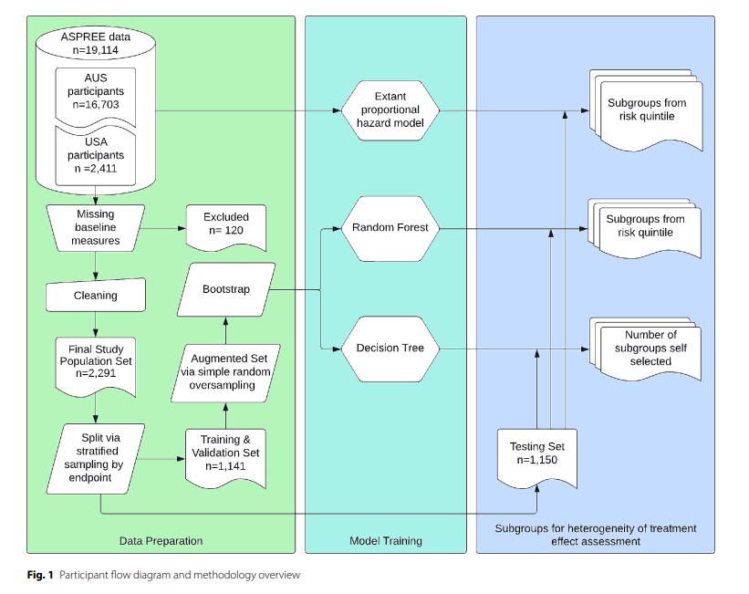

```{r}

```


```{r}
# Create a flow chart to describe my ML workflow -------------------------------
library(DiagrammeR)

PATH_workflow <- grViz(
  "digraph {

    graph [layout = dot, rankdir = LR, splines = ortho, nodesep = 1.5, ranksep = 0.3]
    node  [fontname = Helvetica, fontsize = 11, style = filled, fillcolor = white, color = gray35]
    edge  [color = gray30, arrowsize = 0.7]

    # Datasets (cylinders)
    IST    [label = 'IST', shape = cylinder, fillcolor = 'azure']
    GUSTO  [label = 'GUSTO-1', shape = cylinder, fillcolor = 'azure']
    DIG    [label = 'DIG', shape = cylinder, fillcolor = 'azure']

    # Core workflow
    clean   [label = 'Data cleaning']
    feature [label = 'Feature selection']
    rf      [label = 'Random Forest']
    logit   [label = 'Logistic Regression']
    quart   [label = 'Risk Quartiles']

    # Outputs
    rel     [shape = none, label = 'Forest Plot', shape = doubleoctagon, fillcolor = 'lightsalmon' ]
    abs     [label = 'Absolute Benefit Plot', shape = doubleoctagon, fillcolor = 'lightsalmon']

    classical [label = 'Classical\\nsubgroups', shape = box, fillcolor = 'mistyrose']

    # Flow
    IST   -> clean
    GUSTO -> clean
    DIG   -> clean

    clean   -> feature
    feature -> rf
    feature -> logit

    rf    -> quart
    logit -> quart

    quart -> rel
    quart -> abs

    classical -> rel [style = dashed, color = firebrick, fontcolor = firebrick]
  }"
)

PATH_workflow
```
