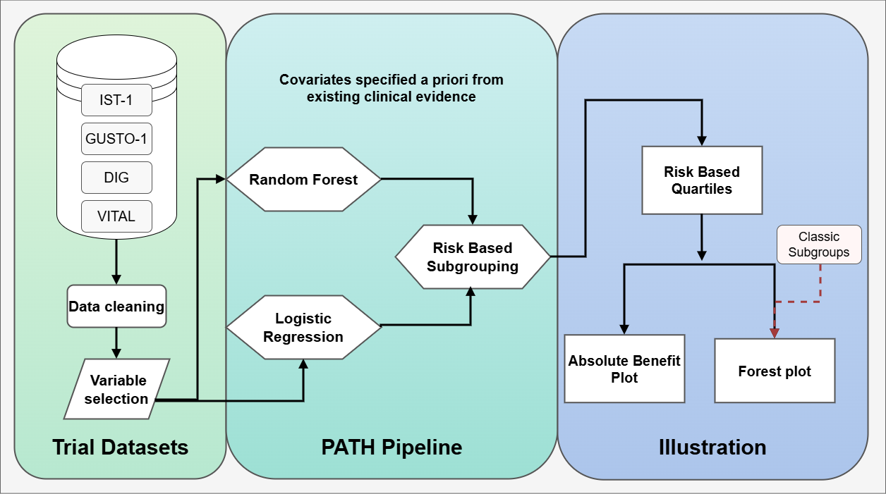

## Agenda

-   Introduction to the PATH statement
-   Outline of Studies and Datasets
-   Methodology
-   Results
-   Discussion and Conclusion

::: {style="margin-top: 4rem; padding: 0.6rem 1rem; border: 1px solid #84003d; border-radius: 10px; display: inline-block; background: #ADD8E6; font-size: 0.8em;"}
<ul style="margin: 0; padding-left: 1.2em;">

<li>This slidedeck was built in {alt="R logo" height="1.2em" style="vertical-align: middle;"} using {alt="Quarto logo" height="1.2em" style="vertical-align: middle;"}</li>

<li>Our Github is linked in The Footer {alt="Quarto logo" height="1.2em" style="vertical-align: middle;"}</li>

</ul>
:::

## The PATH Statement - [Kent et al., 2019](https://pmc.ncbi.nlm.nih.gov/articles/PMC7750907/){style="color: blue;"}

The goal of the PATH statement is to improve reporting of predictive approaches to treatment heterogeneity.

::: {style="margin-top: 2rem; padding: 0.8rem 1.1rem; border: 1px solid #84003d; border-radius: 10px; display: inline-block; background: #ADD8E6; font-size: 0.8em;"}
<ul style="margin: 0; padding-left: 1.2em;">

<li>Treatment effects vary meaningfully across patients with different baseline risks.</li>

<li>Traditional one-variable subgroups often miss important, clinically relevant differences.</li>

<li>PATH combines patient characteristics to estimate more individualized treatment benefit.</li>

</ul>
:::

## Our Studies and Datasets

```{r, echo=FALSE, message=FALSE, warning=FALSE}
library(gt)

trial_summary <- data.frame(
  Characteristic = c("Goal", "Patients (n)", "Years ran", "Design", "Follow-up"),
  IST = c(
    "Aspirin and heparin in acute ischaemic stroke",
    "19,435",
    "1991-1996",
    "Open-label factorial RCT",
    "14 days and 6 months"
  ),
  DIG = c(
    "Digoxin for mortality and hospitalization in heart failure",
    "6,800",
    "1991-1995",
    "Double-blind placebo-controlled RCT",
    "Mean 37 months"
  ),
  GUSTO = c(
    "Thrombolytic strategies in acute myocardial infarction",
    "41,021",
    "1990-1993",
    "Open-label RCT",
    "30 days"
  ),
  VITAL = c(
    "Marine omega-3 fatty acid, Vitamin D3, both or double-placebo in death from cardiovascular causes",
    "25,435",
    "",
    "a 2×2 factorial randomized controlled trial",
    "5 years"
  )
)

trial_summary %>%
  gt() %>%
  cols_label(
    Characteristic = "Characteristic",
    IST = md("[International Stroke Trial](https://pubmed.ncbi.nlm.nih.gov/?term=9174558)"),
    DIG = md("[DIG Trial](https://pubmed.ncbi.nlm.nih.gov/9036306/)"),
    GUSTO = md("[GUSTO-I Trial](https://pubmed.ncbi.nlm.nih.gov/8204123/)"),
    VITAL = md("[VITamin D and OmegA-3 TriaL (VITAL)](https://www.nature.com/articles/s41430-022-01244-w)")
  ) %>%
  tab_options(
    table.border.top.color = "#84003d",
    table.border.bottom.color = "#84003d",
    table.border.left.color = "#84003d",
    table.border.right.color = "#84003d",
    table.border.top.width = px(2),
    table.border.bottom.width = px(2),
    table.border.left.width = px(2),
    table.border.right.width = px(2),
    table_body.hlines.color = "#84003d",
    table_body.vlines.color = "#84003d",
    column_labels.border.bottom.color = "#84003d",
    data_row.padding = px(12),
    column_labels.padding = px(10)
  ) %>%
  tab_style(
    style = cell_borders(sides = "right", color = "#84003d", weight = px(2)),
    locations = cells_body(columns = c("Characteristic", "IST", "DIG", "GUSTO"))
  ) %>%
  tab_style(
    style = cell_borders(sides = "right", color = "#84003d", weight = px(2)),
    locations = cells_column_labels(columns = c("Characteristic", "IST", "DIG", "GUSTO"))
  ) %>%
  tab_style(
    style = cell_text(size = px(22), color = "black"),
    locations = cells_body(everything())
  ) %>%
  tab_style(
    style = cell_text(size = px(23), color = "black", weight = "bold"),
    locations = cells_column_labels(everything())
  )
```

::: {style="margin-top: 1.5rem; padding: 0.6rem 1rem; border: 1px solid #84003d; border-radius: 10px; display: inline-block; background: #ADD8E6; font-size: 0.8em;"}

:::

## Path Workflow

```{r, echo=FALSE, message=FALSE, warning=FALSE}

```

## Simulation Experiment Methodology

```{r, echo=FALSE, message=FALSE, warning=FALSE}
knitr::include_graphics("MCworkflow.png")
```


## Relative Effect Illustration

::: {.columns}
::: {.column width="60%"}

::: {style="margin-top: 0.1rem; width: 98%;"}

```{r, echo=FALSE, message=FALSE, warning=FALSE, out.width='100%'}
knitr::include_graphics("gusto_pres_forest.png")
```

:::

:::

::: {.column .fragment width="40%" data-fragment-index="1"}

::: {style="margin-top: 0.1rem; width: 98%; padding: 0.9rem 1rem; border: 1px solid #84003d; border-radius: 10px; background: #f7f7f7; font-size: 0.78em;"}

```{r}
#| echo: true
#| eval: false
#| code-line-numbers: "|1-5|7|9-13|"
gusto$lp <- predict(
  model1,
  newdata = transform(gusto, tpa = 0),
  type = "link"
)

groups <- cut2(gusto$lp, g = 4)

data.subgroups[10:7, 5] <- paste("Quarter", 1:4)
data.subgroups[10:7, 6] <- "Risk-based subgroups"
data.subgroups[10:7, 1:4] <- cbind(
  events2, nevents2, events1, nevents1
)
```

:::

:::

:::


## Relative Effect Results


- Panel of 4 forest plots?


## Absolute treatment effect

```{r}
Gusto_plot <- readRDS("gusto_plot.rds")
Gusto_plot
```


