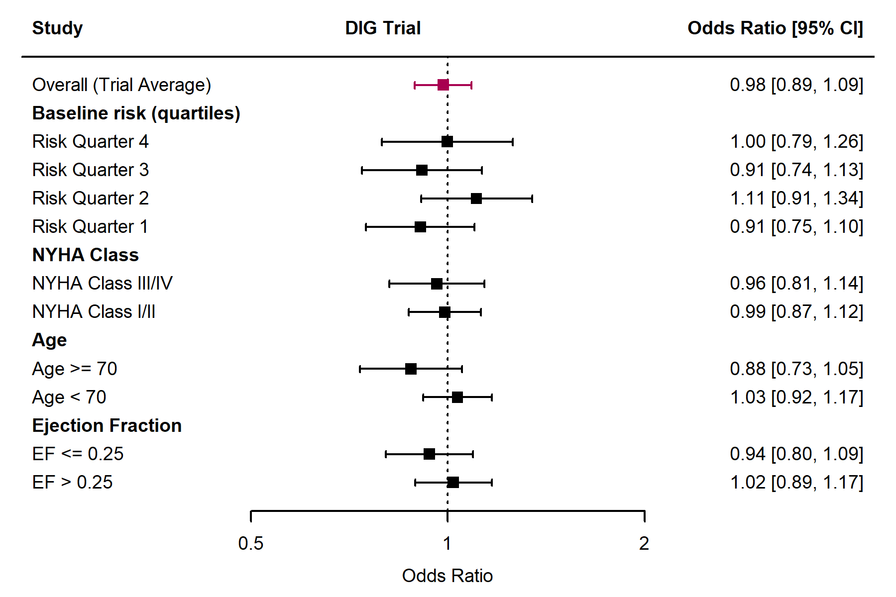
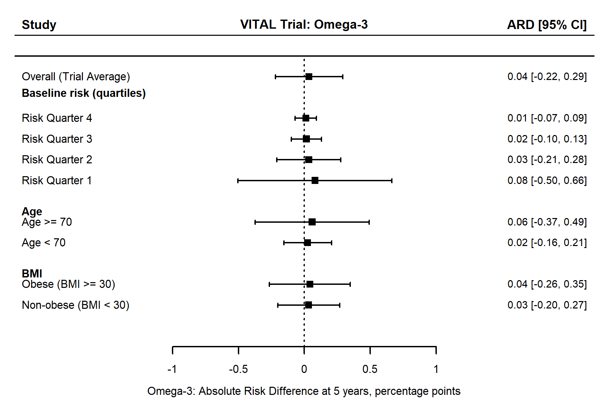
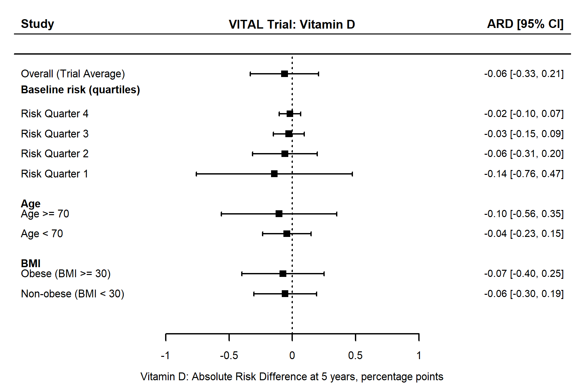
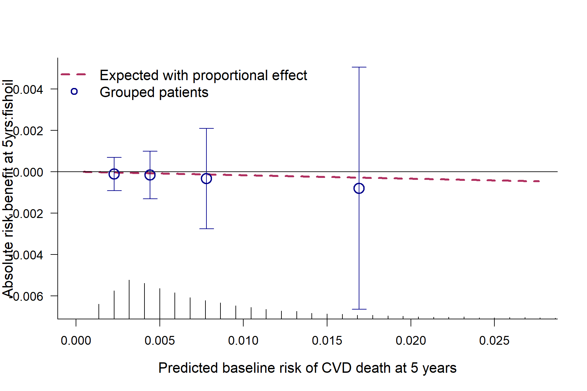
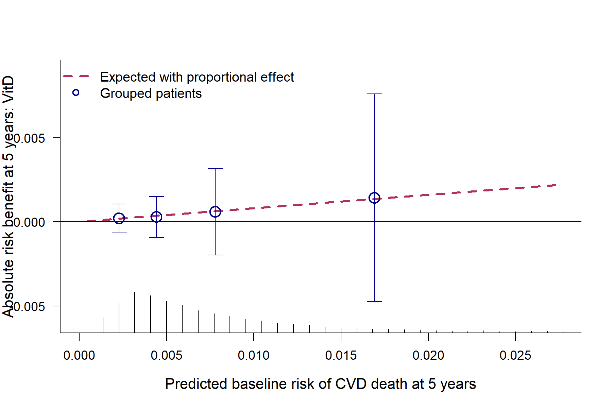

## Agenda {.agenda-slide}

-   Motivation & Methodology behind PATH
-   Empirical Analyses using the PATH
-   Simulation Evidence
-   Implications and Future Directions

::: info-box
<ul>

<li>This slidedeck was built in  using </li>
<li>Our GitHub repository is linked in the footer </li>
</ul>
:::

## Treatment Effect Heterogeneity{.concept-slide}

Responses to a given treatment can vary considerably across individuals within a trial 

::: {.columns .concept-grid}
::: {.column width="33%"}
::: {.concept-card .fragment}

<h3>Average Effect</h3>
<p>
Randomised trials usually report one overall treatment estimate
for the full study population.
</p>
:::
:::

::: {.column width="33%"}
::: {.concept-card .fragment}

<h3>Patient Differences</h3>
<p>Demographics, disease severity, and baseline prognosis can all change the magnitude of treatment benefit.</p>
:::
:::

::: {.column width="33%"}
::: {.concept-card .fragment}

<h3>Subgroup Limitations</h3>
<p>Traditional one-variable subgroup analyses are often underpowered and can miss multivariable response patterns.</p>
:::
:::
:::

::: {.info-box .fragment}
Which patients benefit most, least, or even differently from the same treatment?
:::

## The PATH Statement - [Kent et al., 2019](https://pmc.ncbi.nlm.nih.gov/articles/PMC7750907/) {.path-slide}

The PATH statement provides guidance for analysing and reporting predictive approaches to treatment effect heterogeneity.

::: {.columns .path-grid}
::: {.column width="50%"}
::: {.path-card .fragment}
<div class="path-badge">1</div>
<h3>What PATH Is</h3>
<p>PATH is a reporting framework for <strong>predictive HTE analyses</strong> in randomised trials.</p>
<ul>
<li>It focuses on how treatment benefit varies across <strong>baseline patient profiles</strong>.</li>
<li>Its aim is more individualised estimates of treatment benefit, not just one overall average.</li>
</ul>
:::
:::

::: {.column width="50%"}
::: {.path-card .fragment}
<div class="path-badge">2</div>
<h3>Improvement</h3>
<ul>
<li>PATH analyses allow for multivariate modelling of risk on the individual level</li>
<li>It is better aligned with clinical decisions, where patients differ across several risk factors simultaneously.</li>
</ul>
:::
:::
:::


## Our Studies and Datasets

```{r, echo=FALSE, message=FALSE, warning=FALSE}
library(gt)

trial_summary <- data.frame(
  Characteristic = c("Goal", "Patients (n)", "Years ran", "Design", "Follow-up"),
  IST = c(
    "Aspirin and heparin in acute ischaemic stroke",
    "19,435",
    "1991-1996",
    "Open-label factorial RCT",
    "14 days and 6 months"
  ),
  DIG = c(
    "Digoxin for mortality and hospitalization in heart failure",
    "6,800",
    "1991-1995",
    "Double-blind placebo-controlled RCT",
    "Mean 37 months"
  ),
  GUSTO = c(
    "Thrombolytic strategies in acute myocardial infarction",
    "41,021",
    "1990-1993",
    "Open-label RCT",
    "30 days"
  ),
  VITAL = c(
    "Marine omega-3 fatty acid, Vitamin D3, both or double-placebo in death from cardiovascular causes",
    "25,435",
    "2011-2017",
    "a 2×2 factorial randomized controlled trial",
    "5 years"
  )
)

trial_summary %>%
  gt() %>%
  cols_label(
    Characteristic = "Characteristic",
    IST = md("[International Stroke Trial](https://pubmed.ncbi.nlm.nih.gov/?term=9174558)"),
    DIG = md("[DIG Trial](https://pubmed.ncbi.nlm.nih.gov/9036306/)"),
    GUSTO = md("[GUSTO-I Trial](https://pubmed.ncbi.nlm.nih.gov/8204123/)"),
    VITAL = md("[VITamin D and OmegA-3 TriaL (VITAL)](https://www.nature.com/articles/s41430-022-01244-w)")
  ) %>%
  tab_options(
    table.border.top.color = "#84003d",
    table.border.bottom.color = "#84003d",
    table.border.left.color = "#84003d",
    table.border.right.color = "#84003d",
    table.border.top.width = px(2),
    table.border.bottom.width = px(2),
    table.border.left.width = px(2),
    table.border.right.width = px(2),
    table_body.hlines.color = "#84003d",
    table_body.vlines.color = "#84003d",
    column_labels.border.bottom.color = "#84003d",
    data_row.padding = px(12),
    column_labels.padding = px(10)
  ) %>%
  tab_style(
    style = cell_borders(sides = "right", color = "#84003d", weight = px(2)),
    locations = cells_body(columns = c("Characteristic", "IST", "DIG", "GUSTO"))
  ) %>%
  tab_style(
    style = cell_borders(sides = "right", color = "#84003d", weight = px(2)),
    locations = cells_column_labels(columns = c("Characteristic", "IST", "DIG", "GUSTO"))
  ) %>%
  tab_style(
    style = cell_text(size = px(22), color = "black"),
    locations = cells_body(everything())
  ) %>%
  tab_style(
    style = cell_text(size = px(23), color = "black", weight = "bold"),
    locations = cells_column_labels(everything())
  )
```

::: {.info-box}
<strong>Why these studies?</strong> Large N, Availability, Contrasting Outcomes
:::

## Overall outcome of studies {.outcomes-slide}

::: {.columns .outcomes-grid}
::: {.column width="50%"}
::: {.outcome-card .fragment}

<p><strong>Beneficial overall effect:</strong> aspirin reduced death or non-fatal recurrent stroke <strong>(OR 0.89)</strong>.</p>
:::
:::

::: {.column width="50%"}
::: {.outcome-card .fragment}

<p><strong>No clear overall difference:</strong> all-cause mortality was similar for digoxin versus placebo <strong>(RR 0.99)</strong>.</p>
:::
:::
:::

::: {.columns .outcomes-grid}
::: {.column width="50%"}
::: {.outcome-card .fragment}
<strong>GUSTO-1</strong> 
<p><strong>Beneficial overall effect:</strong> 30-day mortality was lower with accelerated tPA than with streptokinase <strong>(OR 0.85)</strong>.</p>
:::
:::

::: {.column width="50%"}
::: {.outcome-card .fragment}

<p><strong>No clear overall difference:</strong> vitamin D supplementation did not lower cancer or cardiovascular events compared with placebo.</p>
:::
:::
:::

## Path Workflow {.workflow-slide}

::: {.columns}
::: {.column width="74%"}
::: {.workflow-card}
```{r, echo=FALSE, message=FALSE, warning=FALSE, out.width='100%'}
knitr::include_graphics("PATH.png")
```
:::
:::

::: {.column width="26%"}
::: {.workflow-side-card}

<p><strong>Stage 1:</strong> Prepare Datasets for Analysis.</p>
<p><strong>Stage 2:</strong> Model Baseline risk using appropriate method.</p>
<p><strong>Stage 3:</strong> Visualise Treatment Heterogeneity on Relative and Absolute Scales.</p>
:::
:::
:::

## Logistic Regression Specification

<strong>IST-I:</strong> Model adjustment was informed by [Thompson et al., 2015](https://pubmed.ncbi.nlm.nih.gov/25497979/).

::: {style="margin-top: 1rem; padding: 0.8rem 1rem; border: 1px solid #84003d; border-radius: 10px; background: #ADD8E6; font-size: 0.8em;"}
$$
\text{logit}\big(P(\text{death14}_i = 1)\big)
=
\beta_0
+ \beta_1 \text{AGE}_i
+ \beta_2 \text{consc}_i \\
\qquad
+ \beta_3 \text{ct\infarct}_i 
+ \beta_4 \text{motor}_i
+ \beta_5 \text{afib}_i
$$
:::

<strong>GUSTO-I:</strong> model adjustment was informed from [Steyeberg et al., 2000](https://www.sciencedirect.com/science/article/pii/S0002870300900012).

::: {style="margin-top: 0.8rem; padding: 0.8rem 1rem; border: 1px solid #84003d; border-radius: 10px; background: #ADD8E6; font-size: 0.8em;"}

$$
\text{sysbp}_{\text{maxed},i} = \min(\text{sysbp}_i, 120)
$$

$$
\text{logit}\big(P(\text{day30}_i = 1)\big)
=
\beta_0
+ \beta_1 \text{tpa}_i
+ \beta_2 \text{age}_i
+ \beta_3 \text{Killip}_i \\
\qquad
+ \beta_4 \text{sysbp}_{\text{maxed},i}
+ f(\text{pulse}_i)
+ \beta_5 \text{pmi}_i
+ \beta_6 \text{miloc}_i
$$
:::

## Random Forest Specification

-   The random forest models were fit using all prognostic baseline variables available in each dataset for risk stratification.
-   This flexible strategy was informed by ensemble-learning approaches in the IST trial [Hwangbo et al. 2022](https://www.nature.com/articles/s41598-022-22323-9).

::: {style="margin-top: 1rem; padding: 0.8rem 1rem; border: 1px solid #84003d; border-radius: 10px; background: #ADD8E6; font-size: 0.8em;"}
```{r}
#| echo: true
#| eval: false
rf_fit_IST <- ranger(
  death14 ~ AGE + SEX + RCONSC + RSBP + RATRIAL + RDELAY +
    RSLEEP + RCT + RVISINF + RDEF1 + RDEF2 + RDEF3 + RDEF4 + RDEF5,
  data = IST_df,
  probability = TRUE,
  num.trees = 1000,
  seed = 88
)
```
:::

## Cox Proportional Hazard Model Specification

**VITAL:** Model adjustment was informed by [Caldeira et al., 2022](https://pubmed.ncbi.nlm.nih.gov/36482183/).

::: {style="margin-top: 1rem; padding: 1.2rem 1rem; border: 1px solid #84003d; border-radius: 10px; background: #ADD8E6; font-size: 0.95em; text-align: center;"}

$$
h(t \mid X_i)
=
h_0(t)\exp\Big(
\beta_1 \text{age}_i
+ \beta_2 \text{bmi}_i
+ \beta_3 \text{sex}_i
+ \beta_4 \text{htnmed}_i\\
\qquad
+ \beta_5 \text{currsmk}_i
+ \beta_6 \text{diabetes}_i
+ \beta_7 \text{familyHist}_i
\Big)
$$
:::


## Relative vs Absolute Benefit

## Relative Effect Illustration {.forest-slide}

::: {style="margin-top: 0.1rem; width: 86%; margin-left: auto; margin-right: auto;"}
```{r, echo=FALSE, message=FALSE, warning=FALSE, out.width='88%'}
knitr::include_graphics("gusto_pres_forest.png")

```
:::

::: {.info-box}
<ul>
<li>Risk-based quartiles suggest a broadly similar relative effect, but lower-risk groups have wider confidence intervals.</li>
</ul>
:::

## Relative Effect Results {.results-panel-slide}

::: {.columns .results-panel-grid}
::: {.column width="50%"}
::: {.results-panel-card}
<h3>DIG</h3>

:::
:::

::: {.column width="50%"}
::: {.results-panel-card}
<h3>IST-1</h3>

:::
:::
:::

## VITAL Relative Effect Results {.results-panel-slide}

::: {.columns .results-panel-grid}
::: {.column width="50%"}
::: {.results-panel-card}
<h3>VITAL: Omega-3</h3>

:::
:::

::: {.column width="50%"}
::: {.results-panel-card}
<h3>VITAL: Vitamin D</h3>

:::
:::
:::

## Absolute treatment effect {.absolute-slide}

::: {style="margin-top: 0.1rem; width: 86%; margin-left: auto; margin-right: auto;"}
```{r, echo=FALSE, message=FALSE, warning=FALSE, out.width='88%'}
Gusto_plot <- readRDS("gusto_plot.rds")
Gusto_plot
```
:::

::: {.info-box}
<ul>
<li>In the GUSTO trial, absolute treatment benefit increases as baseline risk increases, with larger gains concentrated in higher-risk patients.</li>
<li>Random forest stratification produced similar quartiles across all studies</li>
</ul>
:::

## Absolute Benefit Results {.results-panel-slide}

::: {.columns .results-panel-grid}
::: {.column width="50%"}
::: {.results-panel-card}
<h3>IST</h3>
```{r, echo=FALSE, message=FALSE, warning=FALSE, out.width='100%', fig.width=8.5, fig.height=5.6}
aspirin_plot <- readRDS("aspirin_plot.rds")
aspirin_plot
```
:::
:::

::: {.column width="50%"}
::: {.results-panel-card}
<h3>DIG</h3>
```{r, echo=FALSE, message=FALSE, warning=FALSE, out.width='100%', fig.width=8.5, fig.height=5.6}
dig_benefit_plot <- readRDS("dig_benefit_baseline_risk_plot.rds")
dig_benefit_plot
```
:::
:::
:::

## VITAL Absolute Benefit Results {.results-panel-slide}

::: {.columns .results-panel-grid}
::: {.column width="50%"}
::: {.results-panel-card}
<h3>VITAL: Omega-3</h3>

:::
:::

::: {.column width="50%"}
::: {.results-panel-card}
<h3>VITAL: Vitamin D</h3>

:::
:::
:::

## Simulation Study Design [Morris et al. 2019](https://pmc.ncbi.nlm.nih.gov/articles/PMC6492164/) {.ademp-slide}

ADEMP is a structured way to summarise a simulation study through its <strong>Aim</strong>, <strong>Data-generating mechanism</strong>, <strong>Estimand</strong>, <strong>Methods</strong>, and <strong>Performance measure</strong>.

::: {.columns .ademp-grid}
::: {.column width="34%"}
::: {.ademp-card .fragment}
<div class="ademp-badge">A</div>
<h3>Aim</h3>
<p>Evaluate whether risk-based interaction testing falsely detects treatment effect heterogeneity under the null</p>
:::
:::

::: {.column width="42%"}
::: {.ademp-card .fragment}
<div class="ademp-badge">D</div>
<h3>Data-Generating Mechanism</h3>
<p>Binary outcomes were generated from:</p>

$$
\text{logit}\{P(Y_i = 1)\} = -2 - 0.5Z_i + 0.5X_i
$$

$$
X_j \sim N(0,1), \qquad Z_i \sim \text{Bernoulli}(0.5)
$$
:::
:::

::: {.column width="24%"}
::: {.ademp-card .fragment}
<div class="ademp-badge">E</div>
<h3>Estimand</h3>
<p>The ground truth under the null was:</p>

$$
H_0:\beta_{Z \times lp}=0
$$
:::
:::
:::

::: {.ademp-card .fragment .ademp-wide-card}
<h3>Simulation Conditions</h3>
<ul>
<li>Sample sizes varied across <strong>n =  50, 75, 100, 150, 200, 300, 500, 750,1000, 2000, 5000</strong>.</li>
<li>The number of prognostic covariates varied from <strong>p = 1</strong> to <strong>p = 10</strong>.</li>
<li>Each dataset was split <strong>50:50</strong> into training and test sets.</li>
</ul>
:::

## ADEMP: Methods and Performance {.ademp-slide}

::: {.columns .ademp-grid}
::: {.column width="45%"}
::: {.ademp-card .fragment}
<div class="ademp-badge">M</div>
<h3>Methods</h3>
<p>Risk modelling and likelihood ratio interaction testing compared:</p>

$$
Y_{\text{null}} \sim Z + lp
$$

<p class="ademp-versus">versus</p>

$$
Y_{\text{null}} \sim Z + lp + Z:lp
$$
:::
:::

::: {.column width="55%"}
::: {.ademp-card .fragment}
<div class="ademp-badge">P</div>
<h3>Performance Measure</h3>
<p>Empirical rejection rate at <strong>&alpha; = 0.05</strong>.</p>
```{r}
knitr::include_graphics("Heatmap_MC.png")
```
:::
:::
:::


## Ongoing Work

-   Extend the Monte Carlo framework to assess power, examining how reliably interaction effects are detected as both sample size and effect strength vary.

$$
\text{logit}\{P(Y_i = 1)\}
=
-2 -0.5Z_i + 0.5X_i + \gamma(Z_iX_i)
$$

-   Complete the written interpretation of the simulation and empirical results, including implications, limitations, and presentation of the final figures.

## Implications and Conclusion {.conclusion-slide}

::: {.columns .conclusion-grid}
::: {.column width="33%"}
::: {.conclusion-card .fragment}

<h3>Dataset Requirements</h3>
<p>PATH is most feasible in large, well-characterised datasets where baseline risk and subgroup differences can be estimated reliably.</p>
:::
:::

::: {.column width="33%"}
::: {.conclusion-card .fragment}
<h3>Interaction Strength</h3>
<p>The usefulness of PATH also depends on interaction strength: when heterogeneity is weak, detection may remain difficult even in strong datasets.</p>
:::
:::

::: {.column width="33%"}
::: {.conclusion-card .fragment}
::: {.conclusion-logo-row}


:::
<h3>Implementation</h3>
<p>Implementation may depend on future reporting expectations from major regulators, but there is currently no routine regulatory requirement for PATH analyses.</p>
:::
:::
:::

## References {.references-slide}

::: {.columns .references-grid}
::: {.column width="50%"}
- Kent DM, van Klaveren D, Paulus JK, et al. The Predictive Approaches to Treatment Effect Heterogeneity (PATH) Statement: Explanation and Elaboration. *Ann Intern Med.* 2020;172(1):W1-W25.
- Morris TP, White IR, Crowther MJ. Using simulation studies to evaluate statistical methods. *Stat Med.* 2019;38(11):2074-2102.
- International Stroke Trial Collaborative Group. The International Stroke Trial (IST): a randomised trial of aspirin, subcutaneous heparin, both, or neither among 19,435 patients with acute ischaemic stroke. *Lancet.* 1997.
- The Digitalis Investigation Group. The effect of digoxin on mortality and morbidity in patients with heart failure. *N Engl J Med.* 1997;336:525-533.
- The GUSTO Investigators. An international randomized trial comparing four thrombolytic strategies for acute myocardial infarction. *N Engl J Med.* 1993;329:673-682.
:::

::: {.column width="50%"}
- Manson JE, Cook NR, Lee IM, et al. Marine n-3 fatty acids and prevention of cardiovascular disease and cancer. *N Engl J Med.* 2019;380:23-32.
- Caldeira D, Costa J, Fernandes RM, et al. Analysis of the VITAL cohort. *Eur J Clin Nutr.* 2022.
- Thompson DDO, et al. Adjustment model specification for 14-day mortality in the International Stroke Trial. 2015.
- Steyerberg EW, et al. Adjustment model specification in the GUSTO-I trial. 2000.
- Hwangbo H, et al. Ensemble-learning approaches for treatment heterogeneity analysis in the IST trial. *Sci Rep.* 2022;12.
:::
:::
